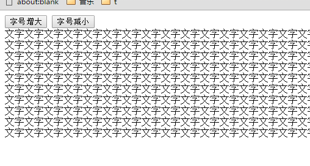

# 大纲 #

1. DOM(文档对象模型)
2. 节点操作
3. 事件监听


# 课堂内容 #


## 补充 ##
Markdown 与 简书

## DOM(文档对象模型) ##

Document Object Model 文档对象模型

DOM ： Document Object Model文档对象模型，所有的HTML标签都是对象，非常方便得到、操作。不是操作字符串，而是操作对象。

```
标签 <span> <div>     (css 中)
元素 <div id="div1">  (js 中)
节点 <div> <span>     (DOM 中)
```

### 获取节点 ###

驼峰命名法介绍

document.getElementById


### 节点操作（预习） ###
	
创建元素,添加元素，删除元素，替换元素，克隆元素	

createElement appendChild insertBefore removeChild replaceChild cloneNode

参考了解
https://developer.mozilla.org/zh-CN/docs/Web/API/Document/createElement


## 更改HTML属性 ##

HTML标签有很多属性，比如src、href、title等等。
JS可以更改HTML的任何属性，方法是两种：点语法 和 setAttribute()、getAttribute()。

#### 【案例】 网页换肤 ####

css 样式表在 css 文件夹
```
<link id="link" href="css/css1.css" rel="stylesheet" type="text/css" />


<dl id="message">
	<form>
		<dt>
			<strong>可以换肤的提交框：</strong>
			<input type="button" value="皮肤1" data-css="css1" />
			<input type="button" value="皮肤2" data-css="css2" />
		</dt>
		<dd>输入姓名：<input class="text" type="text" /></dd>
		<dd>输入密码：<input class="text" type="password" /></dd>
		<dd>请您留言：<textarea></textarea></dd>
		<dd class="center"><input class="btn" type="submit" value="提交" /></dd>
	</form>
</dl>

```

#### 更改元素中的图片 ####

### 操作元素样式 ###

通过点语法.style能够得到所有样式的封装  注意，只能得到行内样式，所有写在css内嵌的、外联的，一律不能得到。需要我们后面学习的知识，得到计算后样式。


### 进度条 ###

```
<style>
	#progress{
		position: relative;
		margin: auto;
		top: 200px;
		display: block;
		width: 200px;
		height: 20px;
		border-style: dotted;
		border-width: thin;
		border-color: darkgreen;
	}
	#filldiv{
		position:absolute;
		top: 0px;
		left: 0px;
		width: 0px;
		height: 20px;
		background: blue;
	}
	#percent{
		position: absolute;
		top: 0px;
		left: 200px;
		
	}
</style>


<div id="progress">
	<div id="filldiv"></div>
	<span id="percent">0</span>
</div>

```


## 事件监听 ##

JavaScript制作交互效果，离不开事件。所谓的事件，就是用户的某个行为，能够触发一个函数的执行


今天我们只学习DOM标准中的0级的事件绑定方法：

```
	// 得到这个box
	var oDiv = document.getElementById("box");
	
	//事件
	oDiv.onclick = function(){
		alert("你好，点我干嘛，我烦着呢！！");
	}

```

也可以：

```

	oDiv.onclick = fun;
	
	function fun(){
		alert("你好，点我干嘛，我烦着呢！！");
	}


```

所以现在你就人格升华了，原来我们想要一个函数执行，必须调用这个函数，比如fun();
但是现在你知道了，一个函数可以当做一个事件的处理函数，当这个事件发生的时候，函数也能执行了。

```

onclick 		单击
onmouseover	鼠标进入
onmouseout		鼠标离开
ondblclick		双击
onfocus			得到焦点
onblur			失去焦点
onmousedown		鼠标按下
onmouseup			鼠标按键抬起

onload 		当页面完全加载成功
window.onload 表示页面中的所有的代码都已经加载完毕了。

```


### 案例 ###

#### 单击输出按钮的内容 ####

```
// 为什么没有写在文档加载之后，为什么 allBtn 不为空
// 因为 getElementsByTagName 方法在得不到元素的情况下，
// 依然会返回一个对象, 只不过这个对象其中的元素个数为 0
// alert(allBtn);
```


```
// 下标为 i 的对象： 内置了很多属性 和 很多方法。但我们可以往这个对象中新增属性，例如
// 在下标为 i 的按钮对象 中新增了一个属性 xxx，并将其中的值设置为 i
allBtn[i].xxx = i;
```


【提醒】通过 闭包函数 来实现

通过绑定函数的的方法，来获取点击按钮的下标
```
function bind(obj, pos) {
	obj.onclick = function() {
		alert(pos);
	}
}

bind(allBtn[i], i);
```


```
	<button>按钮1</button>
	<button>按钮2</button>
	<button>按钮3</button>
	<button>按钮4</button>
	<button>按钮5</button>
	<button>按钮6</button>
```

#### tab标签切换 ####

```
#tab span{display:inline-block;padding:5px 15px;background-color:#ddd;margin:0 3px;border:1px solid #ddd;border-bottom:none;}
.content{padding:15px;border:1px solid #ddd;font-size:24px;background-color:#efefef;}


<div id="tab"><span>辣条</span><span>豆腐</span><span>方便面</span><span>桂林米粉</span></div>
<div class="content">我喜欢吃辣条</div>
<div class="content">吃完豆腐池辣条</div>
<div class="content">喜欢去超市捏方便面</div>
<div class="content">桂林米粉哪里最正宗</div>

```

#### 简易日历 ####

单击某个按钮，显示数组中对应的信息

```
<style type="text/css">
* { padding: 0; margin: 0; }
li { list-style: none; }
body { background: #f6f9fc; font-family: arial; }

.calendar { width: 210px; margin: 0 auto; padding: 10px 10px 20px 20px; background: #eae9e9; }
.calendar ul { width: 210px; overflow: hidden; padding-bottom: 10px; }
.calendar li { float: left; width: 58px; height: 54px; margin: 10px 10px 0 0; border: 1px solid #fff; background: #424242; color: #fff; text-align: center; cursor: pointer; }
.calendar li h2 { font-size: 20px; padding-top: 5px; }
.calendar li p { font-size: 14px; }

.calendar .active { border: 1px solid #424242; background: #fff; color: #e84a7e; }
.calendar .active p { font-weight: bold; }

.calendar .text { width: 178px; padding: 0 10px 10px; border: 1px solid #fff; padding-top: 10px; background: #f1f1f1; color: #555; }
.calendar .text h2 {font-size: 14px; margin-bottom: 10px; }
.calendar .text p { font-size: 12px; line-height: 18px; }

</style>


	var arr=['快过年了，大家可以商量着去哪玩吧～',
		'大家好好学习吧222222~~~',
		'大家好好学习吧222222333~~~',
		'大家好好学习吧222444222~~~',
		'大家好好学习555吧222222~~~',
		'大家好好学习吧666222222~~~',
		'大家好好学习吧227772222~~~',
		'大家好好学习吧28888822222~~~',
		'大家好好学习吧99999222222~~~',
		'大家好好学习10000000吧222222~~~',
		'大家好好学习吧111111222222~~~',
		'大家好好学习吧22222200000000000~~~']


<div id="tab" class="calendar">

    <ul id="ul">
        <li class="active"><h2>1</h2><p>JAN</p></li>
        <li><h2>2</h2><p>FER</p></li>
        <li><h2>3</h2><p>MAR</p></li>
        <li><h2>4</h2><p>APR</p></li>
        <li><h2>5</h2><p>MAY</p></li>
        <li><h2>6</h2><p>JUN</p></li>
        <li><h2>7</h2><p>JUL</p></li>
        <li><h2>8</h2><p>AUG</p></li>
        <li><h2>9</h2><p>SEP</p></li>
        <li><h2>10</h2><p>OCT</p></li>
        <li><h2>11</h2><p>NOV</p></li>
        <li><h2>12</h2><p>DEC</p></li>
    </ul>
    
    <div class="text" id="txt">
        <h2>1月活动</h2>
        <p>快过年了，大家可以商量着去哪玩吧～</p>
    </div>

</div>
```


#### 父节点的应用 ####

```
<style>
  a {cursor: pointer;}
</style>

<h1> 今日头条 </h1>

<ul id="ul1">
	<li>我机巡航南海释放重大信号 轰6曾突破日美封锁链  <a>&times;</a></li>
	<li>少林寺自家门口遇假僧：陪NBA球星韦德拜佛的不是我们... <a>&times;</a></li>
	<li>李克强谈互联网+物流：既是发展新经济，又能提升传统.. <a>&times;</a></li>
	<li>这位85后技术男，要实现APP之间的深度链接  <a>&times;</a></li>
	<li>国内两大白帽子关闭 引猜测  <a>&times;</a></li>
</ul>

```


#### 手风琴 ####


```
<style>
		.hide{display:none;}

		#div1{border:1px solid #ddd;padding:1px;}
		#div1 h4{margin:1px;background-color:#ddd;padding:15px;}
		#div1 .content{display:none;height:120px;padding:15px;}
</style>

	<div id="div1">
		<h4>标题1</h4>
		<div class="content">#内容1</div>
		<h4>标题2</h4>
		<div class="content">#内容2</div>
		<h4>标题3</h4>
		<div class="content">#内容3</div>
		<h4>标题4</h4>
		<div class="content">#内容4</div>
		<h4>标题5</h4>
		<div class="content">#内容5</div>
	</div>


```


# 作业 #


1） 鼠标碰到“十天内免登陆”就会有黄框出现；离开就消失。

2） 简单轮播图，老师帮你布局，自己写程序

3） 字号的变化：




## 选做 ##


1. 全选和反选checked


```
	<table id="dataList">
		<thead>
			<th><input type="checkbox" name="all" id="all"></th>
			<th>爱好</th>
		</thead>
		<tbody>
			<tr>
				<td><input type="checkbox" name="hobby"></td>
				<td>篮球</td>
			</tr>
			<tr>
				<td><input type="checkbox" name="hobby"></td>
				<td>足球</td>
			</tr>
			<tr>
				<td><input type="checkbox" name="hobby"></td>
				<td>羽毛球</td>
			</tr>
			<tr>
				<td><input type="checkbox" name="hobby"></td>
				<td>爬山</td>
			</tr>
			<tr>
				<td><input type="checkbox" name="hobby"></td>
				<td>游泳</td>
			</tr>
			<tr>
				<td><input type="checkbox" name="hobby"></td>
				<td>购物</td>
			</tr>
			<tr>
				<td><input type="checkbox" name="hobby"></td>
				<td>看电影</td>
			</tr>
			<tr>
				<td><input type="checkbox" name="hobby"></td>
				<td>旅游</td>
			</tr>
			<tr>
				<td><input type="checkbox" name="hobby"></td>
				<td>音乐</td>
			</tr>
			<tr>
				<td><input type="checkbox" name="hobby"></td>
				<td>画画</td>
			</tr>
		</tbody>
	</table>
```


2. 手风琴

3. 简易日历

4. 鼠标碰到“十天内免登陆”就会有黄框出现；离开就消失


