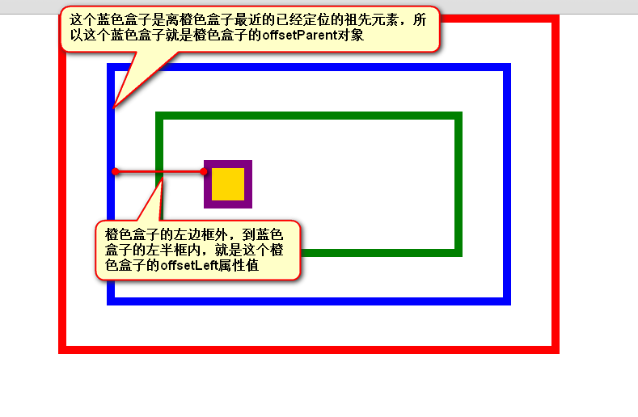

# 大纲 #

1. 快捷位置和尺寸
2. 运动
3. 无缝滚动


# 课堂内容 #

## 快捷位置和尺寸 ##

### offsetLeft属性和offsetTop属性 ###

这两个属性的兼容性非常差，不要着急，我们慢慢来看。

IE9、IE9+、Chrome等高级浏览器：

一个元素的offsetLeft值，就是这个元素左边框外，到自己的offsetParent对象的左边框内的距离。





每一个元素，天生都有一个属性，叫做offsetParent，表示自己的“偏移参考盒子”，我们不称呼中文，就叫offsetParent。这个offsetParent是谁呢？
就是自己祖先元素中，离自己最近的已经定位的元素，如果自己的祖先元素中，没有任何盒子进行了定位，那么offsetParent对象就是body。


【兼容代码】 参考笔记


### offsetWidth和offsetHeight ###

全线兼容，是自己的属性，和别的盒子无关。
一个盒子的offsetWidth值就是自己的 width+左右padding+左右border的宽度


### clientWidth和clientHeight ###
client表示“客户端”这里就是一个名字而已，不用在意这个名字。
clientWidth就是自己的width+padding的值。 也就是说，比offsetWidth少了border。

如果盒子没有宽度，那么那么所有浏览器都将把px值当做clientWidth，而不是100%
如果盒子没有高度，用文字撑的，IE6 clientHeight是0，其他浏览器都是数值。

总结一下，我们的6个属性要铭记于心，就offsetLeft、offsetTop比较闹腾，但是合理使用，也没兼容问题了。
 


## 运动 ##

### 运动模型 ###

定时器
setInterval  clearInterval
window对象有一个方法，叫做
```
	window.setInterval(函数，间隔时间);
```

能够使每间隔时间，调用函数一次。我们习惯叫做定时器，按理说叫做“间隔器”。


### 简单的运动 ###
视觉暂留：把连续相关的画面，连续播放，就是运动了。


那么现在我们来研究一个事儿，如果让这个盒子跑得更快？


### 定时器的停止 ###

setInterval的时候，要给这个定时器一个变量引用，停止的时候只需要clearInterval(timer)


### 运动框架 ###


为什么要封装一个运动框架呢？因为你不知道运动的复杂。


## 无缝滚动 ##

原理：障眼法
页面上是6个图片，编号0、1、2、3、4、5。
复制一倍在后面，长长的火车在移动：


思路：
1. 外层大盒子 遮盖 住
2. 里面 ul 盒子 移动 left 值
3. 到达底端时重复


### 元素加载完成后 ###

```
var tutu = document.getElementById("tutu");

//使用调试者工具的网络情况模拟
tutu.onload = function(){
	alert(oBox.offsetWidth);
}
```

如何判断所有图片加载完毕

```
		var imgs = document.getElementsByTagName("img");

		//使用调试者工具的网络情况模拟

		// 如果判断所有图片加载完毕，就是计数器啊。一个图片加载完毕之后，立即计数器++
		// 判断计数器是否和总数相同了，如果是，就是所有图片加载完毕了。
		var count = 0;
		for(var i = 0 ; i < imgs.length ; i++){
			imgs[i].onload = function(){
				count++;
				if(count == imgs.length){
					alert("所有图片加载完毕！");
				}
			}
		}
```

### 判断图片的折返点 ###

思路：
1. 在所有图片加载完成之后
2. 获取两份图片中最后一张图片的 offsetLeft 值即可


### 盒子的多属性滚动 ###

#### JSON ####

1. 什么是 JSON
2. JSON的嵌套
3. JSON的添加与删除
4. JSON的遍历

### 运动框架 ###

animate 的制作


## 作业 ##

把今天重点案例重写：
	简单动画，无缝滚动，判断图片加载完成；多属性运动；运动框架的轮子
	

